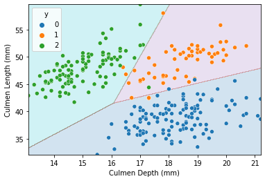
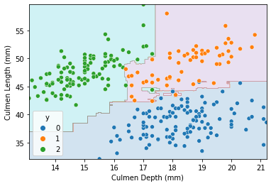
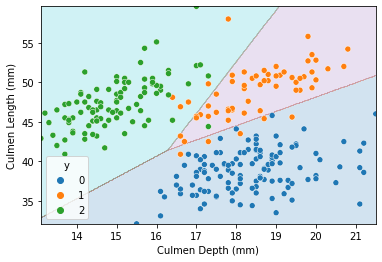


Pic16A_Final_Project

1. Project name: PIC 16A Penguin Classifier

2. Names of group members: James West, Akshat Srivastav

3. Short description of the project: We chose our project idea from the pre-approved project

ideas and decided to work with the Clustering Penguins project. To summarize the goal of this

project, we want to figure out a Machine Learning model that can help us classify a Penguin into

a Species based on certain data points, specifically Island, Culmen Length (mm), and Culmen

Depth (mm).

4. Instructions on how to install the package requirements: To run our jupyter notebook file,

make sure to run all the code cells and download the palmer_penguins.csv file from our Gitbhub

Repo or the Project Specification link(in References and Acknowledgements) to the same file

directory as this .ipynb file. Also accompanying this notebook is the

final_project_custom_class.py file, which can also be found on the GitHub link and needs to be

downloaded to the same file directory as this file for the code to run. Nothing else is needed to

run our files.

5. Detailed description of the demo file:

This demo file is roughly divided into the following sections.

EDA: This section is where we will carry out our Exploratory Data Analysis. We introduce

our dataset and probe it further for relations and correlations amongst the feature and target

variables. We also present instances of where we might need to clean up some data and

introduce the functionalities of the custom class that we have built. Finally, we select the three

features (island, Culmen Length (mm), and Culmen Depth (mm)) that we base our model on.

Model Fitting: In this section, we fit three different classification algorithms on our data:

Logistic Regression, Decision Tree and Support Vector Machine. We evaluate the performance

of these models on the training and test set. We will also consider the cross-validation score in

selecting the best model.

Decision Regions: Below are decision regions/boundaries created by each of our models.

Logistic Regression:

Random Forest Tree:

Support Vector Machine:

Conclusion: After analyzing all of our models that use Culmen Length (mm), Culmen

Depth (mm), and Island features to classify penguins, the Logistic Regression model seems to

do the best job because of its optimal bias-variance tradeoff. The Logistic Regression model has

the most similar training and test score compared to all other models and has a relatively high

cross validation score too. The SVC model has a slightly lower cross validation score whereas

the RandomForest model seems to be overfitting our data. Hence, the Logistic Regression

model does the best job at generalizing on our data given the linear decision boundaries.

6. Scope and limitations, including ethical implications, accessibility concerns, and ideas for

potential extensions: Since our project was about classifying penguins into species, there are no

ethical implications or accessibility concerns from a direct point of view. However, if we were to

extend this concept into classifying humans or citizens of countries based on collected data

points, then ethical implications would be much greater. This is currently happening in China,

where they have been rolling out a social credit system. This system ranks its citizens based on

hobbies and employment among other metrics, and punishes those citizens deemed

'untrustworthy.' With the high potential for bias with classifiers, a system like this is most likely

unfairly punishing certain groups.

7. License and terms of use (probably MIT license): Not Applicable (used open source data set)

8. References and acknowledgements:

Project Specification and Dataset: <https://www.philchodrow.com/PIC16A/project/>

Faculty involved in data collection:

<https://www.uaf.edu/cfos/people/faculty/detail/kristen-gorman.php>ꢀ

Palmer station that collected data: <https://pallter.marine.rutgers.edu/>

9. Background and source of the dataset: For training and evaluating our models, we used the

Palmer Penguins data set, which was collected by Dr.Kristen Gorman and the Palmer

Station,Antarctica LTER as a part of the Long Term Ecological Research Network.

